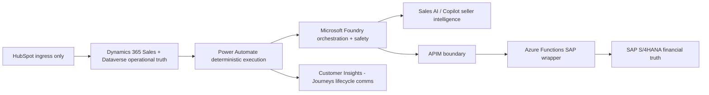

# ASO Architecture and Delivery Model

End-to-end architecture contract, delivery roadmap, target operating model, and trial MVP overlay.

> GitHub path: `docs/architecture/ASO_Architecture_and_Delivery_Model.md`

> Public safety: do not publish tenant IDs, credentials, secrets, real customer data, private endpoints, or connection strings.

## Enterprise architecture contract

This document is the public customer-ready architecture and delivery model for the Agentic Sales Orchestrator. It explains what each platform owns, where the integration boundaries sit, and how the project moves from trial MVP to enterprise-grade implementation without changing the core architecture.

### Non-negotiable architecture boundaries

| Boundary | Mandatory rule | Why it exists |
| --- | --- | --- |
| Operational sales truth | Dynamics 365 Sales / Dataverse is the seller workspace and post-ingress operational truth. | Prevents multiple competing CRM records and protects seller experience. |
| Outbound communication | Customer Insights - Journeys is the only customer lifecycle communication execution layer. | Protects consent, suppression, preference center, compliance, and journey analytics. |
| Deterministic execution | Power Automate owns triggers, approvals, retries, Dataverse updates, and handoffs. | Keeps deterministic process execution separate from AI reasoning. |
| AI orchestration | Microsoft Foundry owns orchestration, routing, schema validation, safety policy, SAP-aware tool coordination, and escalation. | Prevents AI agents from acting independently outside policy. |
| Sales intelligence | Dynamics 365 Sales AI / Copilot Sales agents provide seller-facing intelligence and rationale. | Keeps sales agents advisory unless validated and normalized. |
| ERP integration | SAP is accessed only through Azure API Management and Azure Functions. | Provides controlled security, validation, telemetry, retry, and idempotency boundary. |
| Human control | High-impact commercial actions require seller or manager approval. | Prevents autonomous commercial or ERP-impacting actions. |
| HubSpot boundary | HubSpot remains lead/contact ingress only and is implemented last. | Prevents upstream CRM from owning downstream sales orchestration. |

### Delivery roadmap

```mermaid
flowchart LR
  P1[1 Governance / ALM] --> P2[2 Dataverse / Sales model] --> P3[3 Sales UI / Security] --> P4[4 Customer Insights] --> P5[5 SAP/APIM/Functions] --> P6[6 Sales AI] --> P7[7 Foundry] --> P8[8 Power Automate] --> P9[9 Ops] --> P10[10 E2E no HubSpot] --> P11[11 HubSpot last]
```

| Phase | Name | Primary deliverables | Exit gate |
| --- | --- | --- | --- |
| 1 | Governance, environments, licensing, ALM | Publisher, solutions, naming, environment variables, connection references, control registers. | ASO.Core, ASO.Automation, ASO.Operations created; configuration contract approved. |
| 2 | Dataverse schema and Sales data model | Choices, columns, custom tables, alternate keys, duplicate detection. | Data dictionary approved; schema names frozen. |
| 3 | Dynamics 365 Sales forms, views, security | Lead and Opportunity forms, operational views, roles, field security. | Seller workspace ready; protected fields controlled. |
| 4 | Customer Insights - Journeys plane | Compliance profile, triggers, segments, emails, journeys, writeback model. | Lifecycle communication plane ready and consent-aware. |
| 5 | SAP integration through Azure Functions and APIM | Azure resources, SAP wrapper API, APIM policies, Key Vault, telemetry. | No direct SAP access; APIM + Function wrapper tested. |
| 6 | Dynamics 365 Sales AI / Copilot Sales agents | Sales Qualification Agent, Opportunity / Deal Close Agent, governed mode. | Seller-facing intelligence available without bypassing ASO controls. |
| 7 | Microsoft Foundry orchestrator | Parent orchestrator, child agents, schemas, routing, safety policy, evaluations. | Validated structured output and safety controls. |
| 8 | Power Automate deterministic flows | Lead, Opportunity, CIJ sync, consent, commercial approval, replay flows. | Solution-aware flows with environment variables, connection refs, logs, retries. |
| 9 | Observability, dashboards, alerts, runbooks | App Insights, Dataverse dashboards, alert rules, runbooks, SLAs. | Operational monitoring and support response ready. |
| 10 | End-to-end testing without HubSpot | Tests for leads, SAP reads, opportunity risk, CIJ, approvals, failure modes. | System proven before adding upstream ingress. |
| 11 | HubSpot ingress last | HubSpot -> Dynamics lead/contact ingress only, field mapping, duplicate control. | Ingress tested without changing orchestration ownership. |

### Trial MVP versus enterprise target

The trial MVP and the enterprise target are both valid views. The trial model uses the real trial environments and does not create fake placeholder environments. The enterprise target explains how the solution would be promoted if the programme becomes production-oriented.

| Area | Trial MVP standard | Enterprise target standard |
| --- | --- | --- |
| Environment topology | Use real trial environments only. Do not create fake placeholder rows for environments that will not exist in the MVP. | Use aligned environment stages such as DEV, SIT, UAT, PREPROD, and PROD. |
| Current Sales environment | Use Phoenicarix-Sales as the main ASO build environment. | Use D365-SALES-DEV as the logical DEV environment. |
| Customer Insights | Use Phoenicarix-CI as the separate Customer Insights trial dependency because trial provisioning prevents clean consolidation. | Install Customer Insights into each aligned stage where licensing and compatibility allow. |
| Default environment | Do not use the default environment for ASO build. | Do not use the default environment for enterprise delivery. |
| Configuration placeholders | Create meaningful ASO project configuration placeholders: Foundry URL, APIM base URL, SAP wrapper version, journey keys, HubSpot ingress mode, safety flags. | Replace placeholder values with environment-specific values during deployment. |
| Production placeholders | Do not create fake SIT/UAT/PREPROD/PROD rows if the MVP is not going to production. | Create and govern the actual enterprise environments only when production delivery is in scope. |

### Source basis and design authority

| Source | How it is used |
| --- | --- |
| ASO Enterprise Delivery Setup Guide | Target architecture, phase order, component responsibilities, data model, flows, SAP/APIM, Foundry, Customer Insights, testing, runbooks, and governance. |
| ASO Phase 1 MVP Implementation Guidance | Trial-friendly Phase 1 setup, ASO publisher, solution structure, environment variables, connection references, and MVP constraints. |
| Enterprise Naming Convention Standard | Schema permanence, component naming, view naming, option set rules, Azure naming, and maintainability principles. |
| Microsoft Cloud Adoption Framework naming guidance | Azure resource naming foundation: name permanence, scope, length, valid characters, component order, abbreviations, delimiters, region, environment, and instance numbering. |

> **Note:** Schema contract warning: display names can be changed later. Schema names, logical names, environment variable schema names, API route names, JSON fields, and repository file names become technical contracts. Review before creation.

### Final operating principle

The seller works in Dynamics 365 Sales. Sales Qualification Agent and Sales Opportunity / Deal Close Agent provide seller-facing intelligence. Foundry coordinates those outputs with child agents, SAP read context, schemas, and safety rules. Power Automate performs deterministic updates, approvals, retries, and handoffs. Customer Insights sends lifecycle communications. SAP receives approved commercial submissions only through APIM and Azure Functions. HubSpot remains ingress only.
